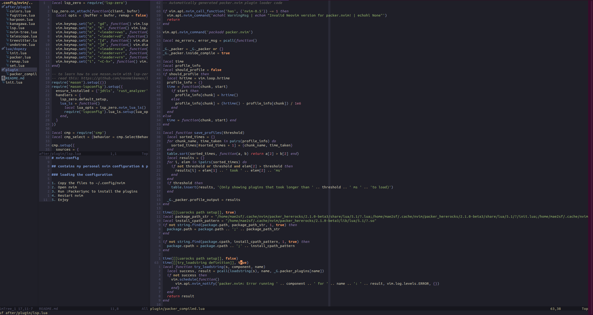
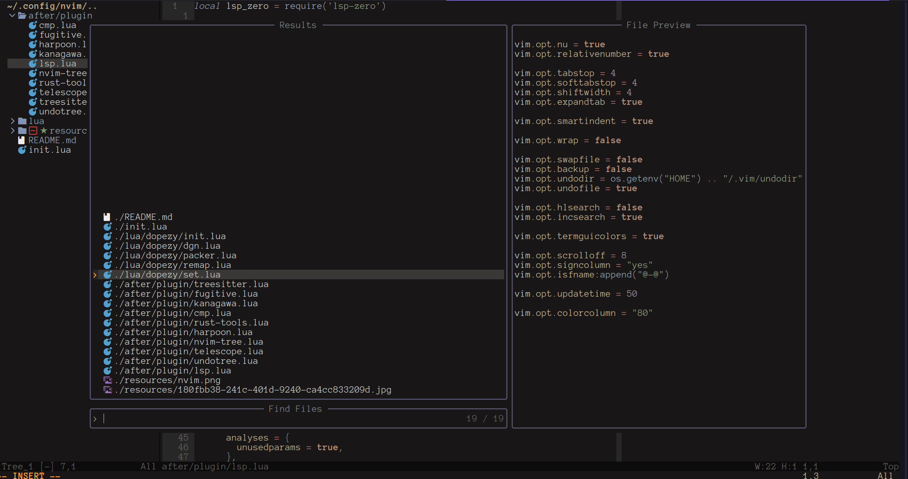

# nvim-config

## contains my personal nvim configuration & plugins of choice

### loading the configuration

1. Copy the files to ~/.config/nvim
2. Open nvim
3. Run :PackerSync to install the plugins
4. Restart nvim
5. Enjoy

--

